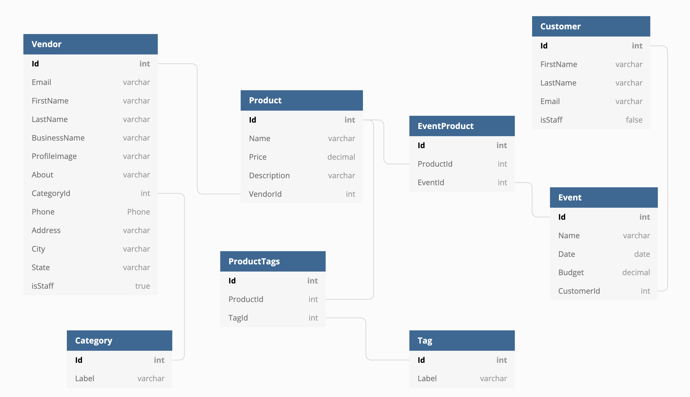

# (App Name)
## Motive
1. Utilize and expand knowledge of REACT
## What is (app name)?
### Installation Instructions
Clone (App) repository 
Run a json-server from the api 
```
npm install
npm start 
```
### Features
### ERD

### Wireframe
(https://www.figma.com/file/f62kRtw9BQptjyxxGytDD3/PlanB-Events?node-id=16%3A54)
### Support
Fill out a support ticket if you discover any major bugs to address. 
### Roadmap
Planned features include: 
- 
### Contributing
Feel free to fork the repository and make pull requests. That said, we have no plans to maintain this project. 
### Authors & Acknowledgments
Special thanks to  
[Name](github handle)
## A Note About Authentication
The login and registration code we use is fake, completely insecure, and would never be implemented in a professional application. It is a simulation authentication using very simplistic tools, because authentication is not a learning objective of students at NSS.
